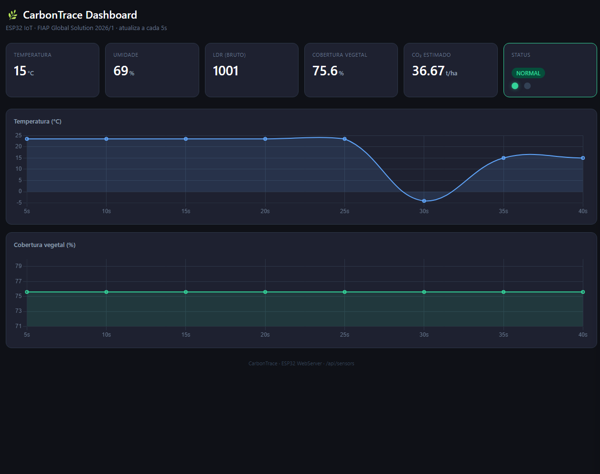
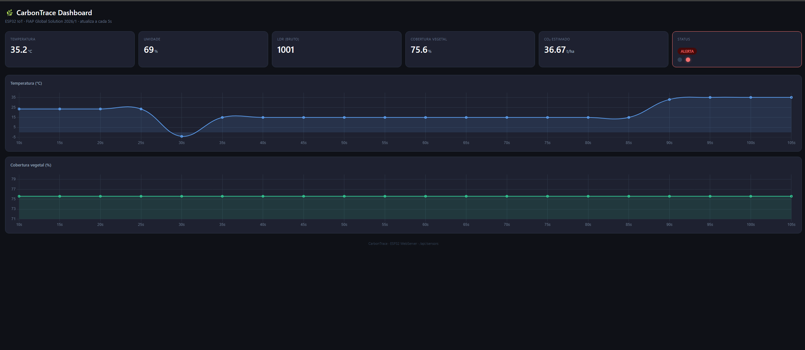

# 🌿 CarbonTrace — IoT Monitor de Desmatamento

> **FIAP Global Solution 2026/1** · Disruptive Architectures: IoT, IoB & Generative IA  
> Turma: 2TDSPG

---

## 👥 Integrantes

| Nome | RM |
|---|---|
| Gabriel Neris Losano | RM564093 |
| João Vitor Biribilli Ravelli | RM565594 |
| Pedro de Matos Previtali | RM564184 |
| Pietro Paranhos Wilhelm *(representante)* | RM561378 |
| Felipe Monte de Sousa | RM562019 |

---

## 📌 Sobre o Projeto

O **CarbonTrace** é uma plataforma de monitoramento de desmatamento e emissões de carbono.  
Este repositório contém o **protótipo IoT** desenvolvido em ESP32, que simula sensores de campo
que complementam o monitoramento via imagens satelitais.

O dispositivo coleta dados ambientais em tempo real, detecta anomalias indicativas de
desmatamento e disponibiliza as informações via **API REST** com dashboard web.

> O módulo IoT é independente da API .NET do projeto — não há integração direta entre os dois.

---

## 🛰️ Conexão com o Tema (Economia Espacial)

Satélites de observação terrestre (como os do programa Sentinel/ESA e Landsat/NASA)
monitoram a cobertura vegetal do planeta. O protótipo IoT simula uma **estação de campo**
que calibra e valida esses dados satelitais com medições locais de:

- 🌡️ Temperatura e umidade do ar (indicadores de saúde florestal)
- ☀️ Luminosidade ambiente (proxy de cobertura do dossel vegetal)

---

## ⚙️ Hardware

### Componentes

| Componente | Função | Pino ESP32 |
|---|---|---|
| DHT22 | Temperatura e umidade | GPIO4 |
| LDR (fotoresistor) | Luminosidade / cobertura vegetal | GPIO34 (ADC) |
| Push Button | Reset manual de alertas | GPIO14 |
| LED Verde | Área segura (NORMAL) | GPIO18 |
| LED Vermelho | Alerta de desmatamento | GPIO19 |
| Buzzer | Alarme sonoro ao detectar alerta | GPIO23 |
| LCD 16×2 I2C | Interface local de dados | SDA=21 / SCL=22 |

### Diagrama de ConexõesESP32 GPIO4  ──→ DHT22 DATA
ESP32 GPIO34 ──→ LDR (divisor de tensão)
ESP32 GPIO14 ──→ Push Button (INPUT_PULLUP)
ESP32 GPIO18 ──→ Resistor 220Ω → LED Verde
ESP32 GPIO19 ──→ Resistor 220Ω → LED Vermelho
ESP32 GPIO23 ──→ Buzzer
ESP32 GPIO21 ──→ LCD SDA (I2C)
ESP32 GPIO22 ──→ LCD SCL (I2C)

---

## 🧠 Lógica de FuncionamentoLDR lê luminosidade (0–4095 ADC)
↓
Cobertura vegetal (%) = 100 - (LDR / 4095 × 100)
↓
CO₂ estimado (ton/ha) = (1 - cobertura/100) × 150
↓
ALERTA se: LDR > 2500  OU  Temperatura > 35°C
↓
LED Vermelho + Buzzer (1s) + LCD "!ALERT"

**Referência:** Áreas desmatadas emitem aproximadamente 150 tonCO₂/ha/ano
(base: IPCC AR6, dados de emissão por uso da terra).

---

## 🌐 API REST — Endpoints

Base URL (Wokwi): `http://localhost:8180`

### `GET /api/sensors`
Leitura atual de todos os sensores e estado dos atuadores.

```json{
"temperature": "27.4",
"humidity": "68.2",
"ldr_raw": 1820,
"coverage_pct": "55.6",
"co2_ton_ha": "66.60",
"alert": false,
"status": "NORMAL",
"led_green": true,
"led_red": false,
"uptime_s": 120
}

---

### `GET /api/status`
Status do dispositivo, thresholds ativos e contagem do histórico.

```json{
"device": "CarbonTrace-ESP32",
"firmware": "2.0.0",
"wifi_ssid": "Wokwi-GUEST",
"ip": "10.10.0.2",
"uptime_s": 120,
"alert": false,
"ldr_threshold": 2500,
"temp_threshold_c": 35.0,
"history_count": 5
}

---

### `GET /api/carbon`
Estimativa de emissão de carbono baseada na cobertura vegetal.

```json{
"coverage_pct": "55.6",
"estimated_co2_ton_ha": "66.60",
"risk_level": "MEDIUM",
"ldr_raw": 1820,
"threshold_pct": 70,
"description": "Estimativa baseada em LDR como proxy de cobertura vegetal"
}

`risk_level`: `LOW` (≥70%) · `MEDIUM` (40–69%) · `HIGH` (<40%)

---

### `GET /api/history`
Últimas 10 leituras armazenadas em memória com timestamp de uptime.

```json{
"total_records": 3,
"readings": [
{
"uptime_s": 5,
"temp": "27.4",
"humidity": "68.0",
"ldr": 1820,
"coverage": "55.5",
"co2": "66.75",
"status": "NORMAL",
"alert": false
}
]
}

---

### `POST /api/config`
Altera os thresholds de alerta em tempo real, sem reiniciar o dispositivo.

**Body:**
```json{
"ldr_threshold": 2000,
"temp_threshold": 32.0
}

**Resposta:**
```json{
"message": "Configuracao atualizada",
"ldr_threshold": 2000,
"temp_threshold": 32.0
}

---

### `GET /dashboard`
Painel HTML com gráficos em tempo real (atualiza a cada 5s).  
Inclui formulário para alterar thresholds via `POST /api/config`.

### `GET /api/docs`
Documentação completa da API em HTML.

---

## 🖥️ Como Simular no Wokwi

### Pré-requisitos
- [VS Code](https://code.visualstudio.com/)
- Extensão [Wokwi for VS Code](https://marketplace.visualstudio.com/items?itemName=wokwi.wokwi-vscode)
- [Arduino IDE](https://www.arduino.cc/en/software) com core ESP32 instalado

### Bibliotecas necessárias (Arduino Library Manager)

| Biblioteca | Autor |
|---|---|
| DHT sensor library | Adafruit |
| Adafruit Unified Sensor | Adafruit |
| LiquidCrystal I2C | Frank de Brabander |
| ArduinoJson | Benoit Blanchon |

> `WiFi`, `WebServer` e `Wire` já vêm com o core ESP32.

### Passo a Passo

**1. Clonar o repositório**
```bashgit clone https://github.com/<seu-usuario>/carbontrace-iot
cd carbontrace-iot

**2. Compilar no Arduino IDE**
- Abra `carbontrace_v2.ino`
- Selecione a placa: `ESP32 Dev Module`
- Compile: `Sketch → Verify/Compile` (`Ctrl+R`)
- Os arquivos `.elf` e `.bin` serão gerados em:build/esp32.esp32.esp32doit-devkit-v1/

**3. Iniciar a simulação no VS Code**
- Pressione `F1` → `Wokwi: Start Simulator`
- Aguarde o ESP32 conectar ao Wi-Fi (`Wokwi-GUEST`)
- O IP aparecerá no Serial Monitor

**4. Acessar o dashboard**http://localhost:8180/dashboard

### `wokwi.toml`
```toml[wokwi]
version = 1
elf = "build/esp32.esp32.esp32doit-devkit-v1/carbontrace_v2.ino.elf"
firmware = "build/esp32.esp32.esp32doit-devkit-v1/carbontrace_v2.ino.bin"[[wifi]]
ssid = "Wokwi-GUEST"
password = ""
internet = true
channel = 6[[net.forward]]
from = "0.0.0.0:8180"
to = "target:80"

---

## 🧪 Testando os Endpoints

```bashLeitura atual
curl http://localhost:8180/api/sensorsStatus do dispositivo
curl http://localhost:8180/api/statusEstimativa de carbono
curl http://localhost:8180/api/carbonHistórico
curl http://localhost:8180/api/historyAlterar thresholds
curl -X POST http://localhost:8180/api/config 
-H "Content-Type: application/json" 
-d '{"ldr_threshold": 2000, "temp_threshold": 32.0}'

---
## Funcionamento 



---
## 📁 Estrutura do Repositóriocarbontrace-iot/
├── carbontrace-iot.ino   # Código principal ESP32
├── diagram.json         # Circuito Wokwi
├── wokwi.toml           # Configuração do simulador
└── README.md

---

## 🔗 Links

- 🎥 Vídeo de demonstração: *(link YouTube)*
- 📡 Repositório API .NET: *(link GitHub)*